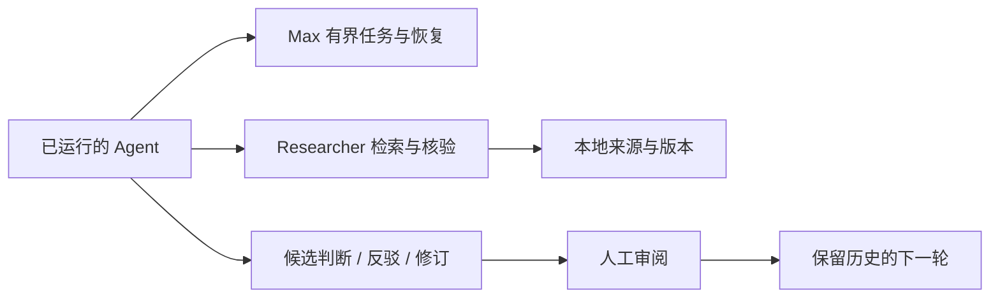

# research-kb

### 给 AI 研究一个可核查、可交接的记忆。

**Evidence-backed memory and governed work handoffs for research agents.**

research-kb 把原文片段、引文核验、候选论证、反驳和研究版本保存在本地，让下一位 Agent 能回到证据继续工作，而不只是继续总结上一份摘要。

面向需要长期追踪材料的研究者，以及希望为现有 Agent 接入研究状态与权限边界的开发者。**开发阶段；本仓库是代码快照，不是开箱即用的云服务。**

[快速了解](#一个具体场景) · [开始尝试](#开始尝试) · [Max 协议](docs/max-research-external-agent.md) · [贡献](CONTRIBUTING.md)

## 一个具体场景

> 你发现上一轮报告把某段原文解释得过强。下一轮不该抹掉旧结论，也不该把旧摘要当成原文。

1. Agent 检索材料，读取有版本身份的 passage。
2. 精确引文核验绑定来源版本；论证仍以 candidate 保存。
3. Agent 提交反驳和修订报告，保留前后版本与未决问题。
4. 人工决定是否接受；另一个获授权 Agent 从研究记录与原文恢复。

**精确引文匹配不等于论证正确，人工接受也不等于来源自动 verified。**

## 三个组件，各管一件事

| 组件 | 负责什么 | 不负责什么 |
|---|---|---|
| Researcher MCP · 12 个工具 | 检索、passage、核验、候选研究记录、审批请求 | 任意 SQL、Shell 或自行批准 |
| Max Control MCP · 10 个工具 | 已运行 Agent 的任务领取、交接、恢复、candidate 提交 | 自动启动另一模型，或保证无人值守运行 |
| Admin CLI / 服务层 | 项目、导入、任务发放、审批决定、备份 | 将这些管理权限暴露给 worker |



Max 源码包含在本仓库，不需要另找一个 Max 项目。不同 Host 的接入模板不等于所有 Host 已完成实机验证；模型名称是自报信息，不能充当认证身份。

## 开始尝试

当前依赖清单包含 `pywin32` 与精确版本锁定，**先按 Windows 开发快照看待**，不宣称 Linux/macOS 可直接安装。使用独立环境，勿指向现用研究库。

```powershell
git clone https://github.com/asuat3290-lab/research-kb.git
cd research-kb
py -3.13 -m venv .venv
.\.venv\Scripts\python.exe -m pip install -e .
.\.venv\Scripts\research-kb.exe --help
```

仓库目前为私有，clone 需要获授权的 GitHub 账号。依赖若无法解析，请报告安装错误，不要把本机环境替换为猜测版本。

**无需真实语料的协议试验**（安装后；使用测试临时库，启动临时本地 MCP 子进程）：

```powershell
.\.venv\Scripts\python.exe -m unittest discover -s tests -p test_max_research_external_agent_mcp.py -v
```

这验证合成任务的跨进程协议，不等于真实文献研究或 Provider 测试。正式接入还需要管理员配置项目、来源 resolver 和合法 work packet；仅启动 MCP 不会自动产生研究任务。

## 能力与边界

- 本地 SQLite / FTS5、显式来源元数据、研究版本与审计记录。
- 核心库 schema 5，独立 Max 控制库 schema 32；不可混为一套迁移。
- Worker 只能提交候选结果；审批请求与审批决定分离。
- 核心研究检索以 lexical 为支持路径，不把未实现的 semantic/hybrid 当作可用能力。
- Provider-driven runner 与 external-agent 路径分开；不宣称真实调用、长期自治研究或研究质量 benchmark 已完成。
- 代码备份不含论文、数据库、凭据、语料或完整运行环境，详见 [上传范围](UPLOAD-SCOPE.md)。

## 从哪里继续

| 你的目标 | 入口 |
|---|---|
| 接入 Desktop / 已运行的 Agent | [External-agent 协议与认证边界](docs/max-research-external-agent.md) |
| 理解研究接口与返回状态 | [工具契约](docs/tool-contract.md) |
| 理解安装治理与配置 | [系统治理](docs/system-governance.md) |
| 查阅完整工程演进记录 | [Implementation notes](IMPLEMENTATION-NOTES.md) |
| 做版本敏感的 MEGA² 原文检索 | [配套 MegaRAG](https://github.com/asuat3290-lab/mega-rag) |

最值得共同完善的部分：可复现的新用户安装、完整的小型合成示例、不同 Host 的真实交接测试，以及以研究质量而非运行时长衡量的评估。

目前未声明开源许可证；私有仓库访问权不等于再分发授权。
