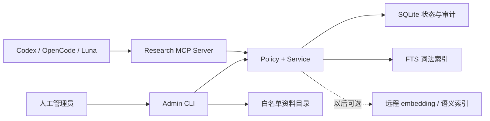

# 架构审查与增量实现路线

## 1. 目标

构建一个通用、轻量、可被不同外部 Agent 使用的本地研究底座：

- 本地保存原始材料、显式来源元数据、检索索引、研究状态、证据和审计记录。
- Codex、OpenCode、GPT-5.6 Luna 等外部 Agent 负责理解、联想、质疑、综合和写作。
- 权限与流程由服务端代码和数据库状态机强制执行，不能只靠提示词自律。
- 所有学科共用“来源—片段—主张—证据—审批”模型。
- 第一版不运行本地 LLM，不依赖向量数据库。

它不是另一个 RAG 聊天应用，而是一个可长期保存材料与研究历史的 research substrate。Agent 可以替换，知识基础和正式状态不会跟着某个模型消失。

## 2. 旧项目审查结论

### <legacy-mega-rag-root>

只作为参考。可借鉴来源目录、研究状态门、证据/报告契约和审计思路。

不复制特定学科假设、模型供应商配置、既有目录耦合，也不复制允许 Agent 传入任意文件路径的接口。

### <legacy-personal-kb-root>

它是有可用零件的未完成原型，不是新系统的基座。

可选择性重写：

- PDF、DOCX、EPUB 文本提取。
- SHA-256 去重。
- SQLite FTS5。
- 稳定 document/passage ID。
- 人工确认引用的工作流。

不继承：

- 单文件巨型程序。
- 通过文件名推断来源类型或权威性。
- 缺少项目范围、权限层、状态机、审计和测试的结构。
- 已损坏的 `index_web.db`。
- 只有约 376 条向量、却对应约 277,887 个片段的不完整 LanceDB。

旧 `index.db` 可以在 MVP 完成后作为只读迁移源。审查时其 SQLite quick_check 正常，约有 1,474 个来源和 277,887 个片段；但大量来源未分类，旧标签必须作为 legacy/unverified 元数据处理。

## 3. 总体架构



### 管理面

只有人工管理员 CLI 可以：

- 初始化和升级数据库。
- 建立或归档项目。
- 从白名单目录导入材料。
- 明确填写或纠正来源类型、作者、日期、语言、版本和可靠性。
- 决定审批。
- 执行备份、恢复、索引重建和旧库迁移。

管理 CLI 不注册为研究 Agent 工具。

### 研究面

MCP 可以搜索、按稳定 ID 阅读、写候选研究、核验来源一致性、提交报告和申请审批，但不能：

- 读取任意文件路径。
- 执行任意 SQL、Shell 或脚本。
- 导入、删除或修复数据库。
- 修改来源可靠性。
- 自己批准正式状态。
- 扩大项目范围或开启网络。

### 数据面

第一版使用单个 SQLite 数据库和 FTS5。SQLite 足以提供事务、外键、触发器、WAL、备份和完整性检查。原始材料位于配置的 corpus roots；Agent 只看到稳定 ID、显式元数据和受限片段。

## 4. 数据模型与不变量

| 实体 | 用途 | 不变量 |
|---|---|---|
| projects | 研究范围 | 每次读写都重新校验项目 |
| documents | 来源身份和元数据 | 内容哈希、来源 URI、导入方式不可变 |
| passages | 可检索来源片段 | 插入后不更新、不删除 |
| project_sources | 项目—来源授权 | Agent 无法自行扩大 |
| research_items | 笔记、假设、反驳、报告 | Agent 只能 draft/candidate |
| research_item_versions | 条目版本 | 只追加 |
| verification_tokens | 短期核验能力 | 单次、过期、actor/来源/引用绑定 |
| verified_evidence | 来源一致性结果 | 不可变；不代表真值或正式接受 |
| evidence_links | 主张—证据关系 | 只追加 |
| approval_requests | 人工审批队列 | MCP 只能请求，CLI 才能决定 |
| search_events | 检索历史 | 项目和会话范围内可追踪 |
| audit_log | 审计 | 只追加，敏感 token 不入日志 |

`001_initial.sql` 已发布且保持不变。Phase 1 的 `002_phase1.sql` 通过版本化 migration runner 增加：

1. verification token 的 project/source version 绑定。
2. evidence status history，将来源一致性核验、candidate 和人工 accepted/rejected 分开。
3. `approval_requests_v2`，支持 research item/evidence target，并通过外键、trigger 和 service 防止悬空 target。
4. `source_metadata_audit`，保存旧值、新值、理由、actor 和时间。
5. 可重建的确定性检索 FTS 缓存。
## 5. 不使用本地模型也能提供灵感

灵感来自 Agent 的推理和检索策略。本地系统提供四种素材动作：

1. 邻近证据：按 passage ID 展开少量上下文。
2. 来源多样化：优先覆盖不同文档、作者、时期和材料类型。
3. 反证检索：Agent 生成反向查询，用 objection 保存反例、隐含前提和替代解释。
4. 跨域联想：在用户授权的多个来源分组中检索相似概念，结果标记为 `cross_domain_analogy`，不能冒充来源事实。

不增加“随机灵感工具”。用 `search_corpus` 的过滤、多样化和反证意图配合 Skill 组织多轮查询即可。

## 6. 必须先解决的中文检索问题

当前框架中的 FTS5 `unicode61` 只是可移植基线，对无空格中文分词不足。开放 MCP 前必须完成中文检索基准。

推荐方案：

- 保留原始 passage 文本。
- 额外生成确定性的 `search_terms`。
- 英文和数字按词规范化，连续 CJK 文本生成重叠二元词。
- 入库和查询使用同一规范化函数。
- FTS 索引 search_terms，返回摘要从原始 passage 生成。
- 不依赖本地分词模型。

备选是 FTS5 trigram 加两字符短查询回退，但必须比较召回、索引体积和 P50/P95 延迟后再选。

最低测试集：

- 2 字、3 字和长中文短语。
- 中英混合术语。
- 英文和带连字符术语。
- 标题与正文命中。
- 不同项目的同词隔离。
- 反证和来源多样化。
- 10 万片段以上的检索性能。

## 7. 固定的 12 个 MCP 工具

1. `search_corpus`
2. `get_passage`
3. `get_document_metadata`
4. `get_research_context`
5. `submit_hypothesis`
6. `submit_objection`
7. `save_research_note`
8. `verify_quote_or_claim`
9. `submit_verified_evidence`
10. `get_search_history`
11. `submit_research_report`
12. `request_user_approval`

详细契约见 `docs/tool-contract.md`。MCP 层负责参数 schema、身份注入、统一响应和错误清洗；所有权限和状态规则必须在 service/policy 层再次执行。

## 8. 实施阶段

### Phase 0：冻结并验证基线

Phase 0 已完成：编译、导入、临时数据库、quick_check、不可变约束、连接关闭、CLI `init/status` 和安全占位 MCP 均已验证。

### Phase 1：数据、检索和管理员闭环

Phase 1 的实现顺序为 A→B→C→D：

- A：版本迁移、安全不变量、token 绑定、evidence 状态历史、审批 target 和 metadata audit。
- B：无模型确定性中英混合检索、原文 excerpt、项目隔离和可重建索引。
- C：项目管理、显式 manifest dry-run/execute、metadata、approval、backup 和 reindex CLI。
- D：迁移、检索、路径、格式、审批、CLI 和完整研究闭环测试，并更新跨平台文档。

Phase 1 交付时，系统仍不提供 MCP 服务；在用户明确批准 Phase 2 后才进入本适配阶段。

### Phase 2：MCP 适配

Phase 2 已完成：使用本机官方 MCP Python SDK 1.27.1 的公开 FastMCP、stdio client 和 ClientSession API，实现并注册正好 12 个研究工具。MCP 固定 actor_kind=agent、role=researcher，使用服务器注入身份和稳定 session；统一 envelope、稳定错误码、边界校验、脱敏日志和 stdout/stderr 约束均已覆盖。semantic/hybrid fail closed，exact quote 核验不声称事实真值，approval 只创建 pending request。

真实官方 client 已完成 list_tools、搜索、passage、hypothesis、objection、exact quote、candidate evidence、report 和 approval request；Phase 0/1 与 Phase 2 合计 22/22 测试通过。

### Phase 3：安全与运维

尚未开始。包括并发 token 消费、恢复、备份、路径边界、错误脱敏和发布候选验收。

### Phase 4：可选 legacy 只读迁移

尚未授权。任何 legacy 迁移都必须先 dry-run，并保持只读、幂等、可断点续跑和原文抽样核对。
## 9. 验收矩阵

| 目标 | 必须证明 |
|---|---|
| 轻量 | 无本地 LLM，semantic 关闭时完整可用 |
| 通用 | 无学科专属结构，source_type 显式可扩展 |
| 可换 Agent | 客户端只依赖标准 MCP 与仓库 Skill |
| 来源边界 | 不按文件名升级可靠性；核验、真值、审批分离 |
| 不可篡改 | accepted、passage、evidence、version、audit 非法修改失败 |
| 项目隔离 | 跨项目 ID、搜索、上下文和历史访问失败 |
| Agent 受限 | 无 SQL/Shell/任意路径/审批决定工具 |
| 可审计 | 搜索、候选写入、核验、审批和管理员决定可追踪 |
| 可恢复 | 备份可恢复，FTS 可重建，迁移可重复 |
| 中文可用 | 中文短语和中英混合达到约定召回与延迟 |
| 灵感能力 | 多样化、反证、跨来源综合有明确认识论状态 |

## 10. MVP 完成定义

```text
人工建项目与导入
  -> Agent 项目内搜索和展开
  -> 假设与反驳
  -> 精确来源核验
  -> 候选证据和候选报告
  -> 人工审批
  -> 不可变正式记录
  -> 下一次 Agent 恢复上下文和搜索历史
```

在这个闭环通过前，不做 UI、知识图谱、自动后台研究、复杂向量数据库或本地模型。


## Phase 3 status note

Phase 3 security and operations validation is complete. Schema version 3 adds issued MCP session binding for new verification tokens and strict research/evidence state transitions without modifying `001_initial.sql` or `002_phase1.sql`. Admin-only online backup, separate-path restore, expired-token terminal cleanup, transactional reindex, project-isolation attack tests, Windows conditional path tests, 20-round token concurrency tests, performance measurements, and wheel/sdist installation checks are covered. Phase 3.5 GitHub/CI work has not started.
